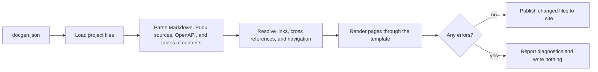

# Introduction

pudu-lang-docgen is the documentation publishing package for Pudu. It reads a project folder described by a `docgen.json` file and writes a complete static website: articles written in Markdown, reference pages generated from the public declarations of Pudu modules, reference pages for HTTP services described with OpenAPI, navigation, a search index, a sitemap, and a cross-reference map that other sites can link against.

The package is a Pudu library. You can drive it from the command line through a small program that calls <xref:PuduLangDocgen.Command.run>, or call the build from your own code through <xref:PuduLangDocgen.Docset.build> and <xref:PuduLangDocgen.Build.plan>.

## What a build produces

| Output | Source | Description |
| --- | --- | --- |
| Article pages | `.md` files | Rendered HTML with an outline, permalinks, and a table of contents. |
| Pudu API reference | `.pudu` files | One page per module and per type, with signatures, documentation, and source links. |
| HTTP API reference | OpenAPI 3 or Swagger 2 in YAML or JSON | Operations grouped by tag, parameters, bodies, responses, and schemas. |
| Catalog pages | `### YamlMime:Dashboard` YAML files | Card galleries such as the [extension catalogs](../extensions/index.md). |
| Navigation | `toc.yml`, `toc.json`, or `toc.md` | Top bar, sidebar, breadcrumbs, and previous and next links. |
| `index.json` | Every indexable page | The search index read by the site's search box. |
| `sitemap.xml` | Every indexable page | A crawler map, written when `sitemap` is configured. |
| `xrefmap.yml` | Every page and declaration with a uid | A cross-reference map other sites can consume. |
| `404.html` | Generated unless you provide one | A not-found page for static hosts. |
| `manifest.json` | The whole build | Every output file with the generator version. |

## How a build works

A build validates the whole site before it writes anything. If any error is found, nothing is published and every problem is reported with its file, line, and a stable [diagnostic code](diagnostics.md).

Publishing is incremental: files whose content did not change are left untouched, and files that a previous build wrote but the current build no longer produces are removed. Build state is kept in the `.docgen` folder beside the configuration.

## Design principles

- **Complete validation first.** Broken links, missing images, unresolved cross references, and unknown table of contents targets are found before output is written.
- **Confined file access.** Every path is checked to stay inside the project, symbolic links are not followed, and raw HTML in articles is reduced to a safe set of elements and attributes.
- **Static output.** The result is plain HTML, CSS, and JavaScript that any static host can serve. Search runs in the browser.
- **Stable identities.** Pages and declarations are addressed by uid, so links survive file moves and other sites can link to yours through the published cross-reference map.

## Next steps

- Follow the [quick start](quick-start.md) to build a first site.
- Read the [basic concepts](concepts.md) to understand content, resources, metadata, and output.
- Browse the [configuration reference](configuration.md) for every `docgen.json` setting.
