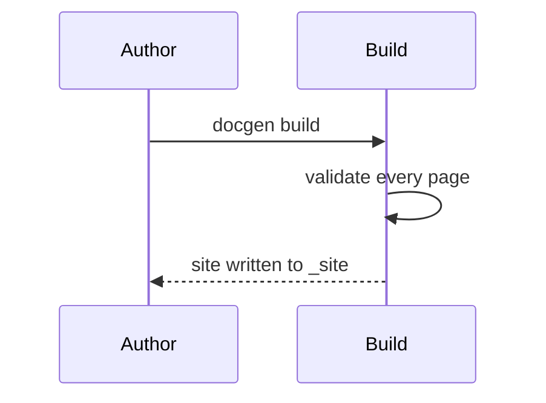
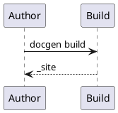

# Markdown authoring

Articles are written in CommonMark with a set of extensions for technical documentation. Each section below shows the source first and the rendered result after it.

> [!NOTE]
> Raw HTML is allowed but reduced to a safe set of elements and attributes. Scripts, styles, event handlers, and unknown elements are shown as text instead of being executed.

## Front matter

An article can start with a YAML block between `---` lines. Its keys become page metadata and override global and file metadata.

```yaml
title: Markdown authoring
uid: guides.markdown
description: Shown in search results and link previews.
keywords: [markdown, authoring]
_disableAffix: true
```

| Key | Effect |
| --- | --- |
| `title` | The page title when the article has no level-one heading, and the title used in navigation. |
| `uid` | The identity other pages use to [cross-reference](cross-references.md) this page. |
| `description` | The summary shown in search results and in link previews. Without it, the first paragraph is used. |
| `redirect_url` | Turns the page into a redirect to another page or address. |

Every template key described in [Templates and theming](templates.md#page-metadata) can also be set here.

## Headings

ATX (`#`) and setext (underlined) headings are supported. Each heading gets a fragment derived from its text; write `{#id}` at the end to choose it. Level-two and level-three headings appear in the **In this article** outline.

```markdown
### Heading with a custom fragment {#custom-fragment}
```

### Heading with a custom fragment {#custom-fragment}

This heading links as [#custom-fragment](#custom-fragment).

## Inline formatting

```markdown
**bold**, *italic*, ~~strikethrough~~, `code`, H~2~O, x^2^, ++inserted++, ==marked==
```

**bold**, *italic*, ~~strikethrough~~, `code`, H~2~O, x^2^, ++inserted++, ==marked==

A backslash at the end of a line, or two trailing spaces, forces a line break.\
This line follows a hard break.

## Lists

```markdown
- Bullet item
  - Nested item
1. Ordered item
2. Second item
- [x] Completed task
- [ ] Open task
```

- Bullet item
  - Nested item

1. Ordered item
2. Second item

- [x] Completed task
- [ ] Open task

## Links and images

Relative links name the Markdown source; the build rewrites them to the published page and reports targets that do not exist. Fragments are checked against the target page's headings.

```markdown
[Configuration reference](configuration.md#build-settings)
<https://www.pudu-lang.org/> and https://github.com/chrismichaelps/pudu-lang-docgen

```

[Configuration reference](configuration.md#build-settings)
<https://www.pudu-lang.org/> and https://github.com/chrismichaelps/pudu-lang-docgen


Images that point at a YouTube or Vimeo page, or at a `.mp4`, `.webm`, `.ogg`, `.ogv`, or `.mov` file, are embedded as video players.

## Tables

Pipe tables support left, center, and right alignment.

```markdown
| Setting | Type | Default |
|:--------|:----:|--------:|
| `output` | text | `_site` |
| `dryRun` | flag | `false` |
```

| Setting | Type | Default |
|:--------|:----:|--------:|
| `output` | text | `_site` |
| `dryRun` | flag | `false` |

## Code blocks

Fenced code blocks are colored by language, labeled with the language name, and carry a copy button. Languages are recognized by name, alias, file extension, or file name.

````markdown
```pudu
fn greet(name: Str) -> Str { "Hello, " + name }
```
````

```pudu
fn greet(name: Str) -> Str { "Hello, " + name }
```

## Code excerpts

Excerpts show part of another file so that samples stay in sync with code that compiles. The path is relative to the article.

| Form | Selects |
| --- | --- |
| `[!code-pudu[](file.pudu)]` | The whole file. |
| `[!code-pudu[](file.pudu#name)]` | The lines between the `<name>` and `</name>` region markers, or `#region name` and `#endregion`. |
| `[!code-pudu[](file.pudu#L3-L9)]` | Lines 3 to 9. |
| `?range=3-9,12-` | Line ranges, relative to the region when one is named. |
| `?highlight=2-3` | Lines emphasized in the output, counted from the first line shown. |
| `?dedent=2` | Removes exactly that indentation; by default the common indentation is removed. |

```markdown
[!code-pudu[](samples/Inventory.pudu#apply?highlight=4-6 "Applying a change")]
```

[!code-pudu[](samples/Inventory.pudu#apply?highlight=4-6 "Applying a change")]

The `:::code` directive writes the same selection as attributes:

```markdown
:::code language="pudu" source="samples/Inventory.pudu" id="types" title="Inventory types":::
```

:::code language="pudu" source="samples/Inventory.pudu" id="types" title="Inventory types":::

## Includes

A whole-line include places the blocks of another Markdown file where it stands. An inline include places the content of a short file inside a sentence. Includes may nest; a cycle is reported as `DG103`.

```markdown
[!INCLUDE[Package modules](includes/package-modules.md)]

The package name is [!include[name](includes/package-name.md)].
```

[!INCLUDE[Package modules](includes/package-modules.md)]

The package name is [!include[name](includes/package-name.md)].

> [!TIP]
> Keep included files out of the `content` globs, as this site does with `exclude`, so they are not also published as pages of their own.

## Alerts

A quote whose first line is `[!KIND]` becomes an alert. The built-in kinds are `NOTE`, `TIP`, `IMPORTANT`, `CAUTION`, and `WARNING`. Other kinds are declared in `markdownEngineProperties.alerts` with the CSS classes they use.

```markdown
> [!NOTE]
> Information the reader should notice.
```

> [!NOTE]
> Information the reader should notice.

> [!TIP]
> Optional advice that helps the reader succeed.

> [!IMPORTANT]
> Information required for success.

> [!CAUTION]
> Negative consequences of an action.

> [!WARNING]
> Dangerous consequences that need immediate attention.

This site declares a `SECURITY` kind styled like a caution:

```json
"markdownEngineProperties": { "alerts": { "SECURITY": "alert alert-caution" } }
```

> [!SECURITY]
> Never commit credentials to a documentation repository.

An unknown kind is reported with `DG107` and rendered as an ordinary quote.

## Tabs

A tab group is a run of headings written as links to `#tab/<id>`, ended by a line holding only `---` or `***`. Tabs with the same id switch together across every group on the page. A tab written `#tab/<id>/<condition>` is shown only while the tab with id `<condition>` is selected in another group.

````markdown
# [macOS](#tab/macos)

```bash
open _site/index.html
```

# [Linux](#tab/linux)

```bash
xdg-open _site/index.html
```

---
````

# [macOS](#tab/macos)

```bash
open _site/index.html
```

# [Linux](#tab/linux)

```bash
xdg-open _site/index.html
```

---

Selecting a tab above also selects the tab with the same id here:

# [macOS](#tab/macos)

Uses the `open` command.

# [Linux](#tab/linux)

Uses the `xdg-open` command.

---

## Rows and columns

`:::row:::` lays out `:::column:::` blocks side by side. `span="2"` makes a column twice as wide. Columns wrap on narrow screens.

```markdown
:::row:::
:::column:::
**Content** is what readers see.
:::column-end:::
:::column span="2":::
**Resources** are copied as they are. This column is twice as wide.
:::column-end:::
:::row-end:::
```

:::row:::
:::column:::
**Content** is what readers see.
:::column-end:::
:::column span="2":::
**Resources** are copied as they are. This column is twice as wide.
:::column-end:::
:::row-end:::

## Image directive

The `:::image` directive places a figure with a larger image to open (`lightbox`). Its `type` is `content` (the default), `icon` (decorative, published without alternate text), or `complex`, which takes a long description up to `:::image-end:::` and shows it in a disclosure.

```markdown
:::image type="content" source="../../images/pudu-lang-short.png" alt-text="The Pudu logo" lightbox="../../images/pudu-lang-short.png":::
```

:::image type="content" source="../../images/pudu-lang-short.png" alt-text="The Pudu logo" lightbox="../../images/pudu-lang-short.png":::

```markdown
:::image type="complex" source="../../images/pudu-lang-short.png" alt-text="The Pudu logo":::
A letter P built from two shapes: a wide rounded bar in medium blue across the top and a narrower light blue stem below it on the left.
:::image-end:::
```

:::image type="complex" source="../../images/pudu-lang-short.png" alt-text="The Pudu logo":::
A letter P built from two shapes: a wide rounded bar in medium blue across the top and a narrower light blue stem below it on the left.
:::image-end:::

## Video

A quote holding only `[!Video address]`, or the `:::video source="address":::` directive, embeds a player. The address must use HTTPS; otherwise the build reports `DG126`.

```markdown
> [!Video https://www.youtube-nocookie.com/embed/VIDEO_ID]

:::video source="https://player.vimeo.com/video/VIDEO_ID":::
```

## Math

Inline math is written between single dollar signs and display math between `$$` lines. Pages that use math load a TeX renderer.

```markdown
The area of a circle is $A = \pi r^2$.

$$
\sum_{k=1}^{n} k = \frac{n(n+1)}{2}
$$
```

The area of a circle is $A = \pi r^2$.

$$
\sum_{k=1}^{n} k = \frac{n(n+1)}{2}
$$

## Diagrams

A `mermaid` code block is drawn as a diagram in the browser, following the light or dark color theme.

````markdown

````


A `plantuml` code block is drawn by a PlantUML server. The public server is used unless `markdownEngineProperties.plantUml` names another server or asks for local rendering.

````markdown

````


## Footnotes

```markdown
The build validates links before writing.[^validation]

[^validation]: Links, images, fragments, and cross references are all checked.
```

The build validates links before writing.[^validation]

## Emoji

Short codes cover every fully qualified emoji: Unicode names in lower case joined by underscores, plus common aliases.

```markdown
:tada: :rocket: :white_check_mark: :thumbs_up_medium_skin_tone:
```

:tada: :rocket: :white_check_mark: :thumbs_up_medium_skin_tone:

## Entities and raw HTML

Named and numeric character references are decoded: `&copy; &rarr; &#8364;` renders as &copy; &rarr; &#8364;.

Allowed HTML elements keep their safe attributes:

```html
<details>
<summary>Show the build output</summary>
<p>Build succeeded: 42 written, 0 unchanged, 0 removed.</p>
</details>
```

<details>
<summary>Show the build output</summary>
<p>Build succeeded: 42 written, 0 unchanged, 0 removed.</p>
</details>

## Cross references

`<xref:uid>`, `@uid`, and `[text](xref:uid)` link to any page or declaration by identity. For example, <xref:PuduLangDocgen.Docset.build> and [the build plan](xref:PuduLangDocgen.Build.plan). See [Links and cross references](cross-references.md) for every form.

[^validation]: Links, images, fragments, and cross references are all checked.
